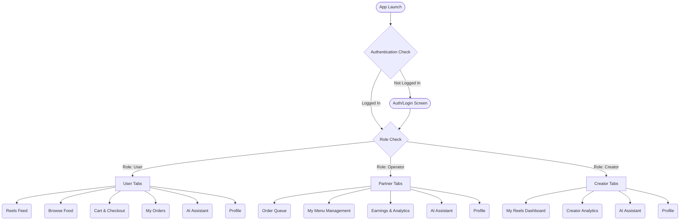

# FoodMeniaRN 🍔

A premium, multi-role React Native mobile application built with Expo. FoodMeniaRN is a comprehensive platform that combines food ordering, restaurant partner management, and food content creation into a single, cohesive experience.

## ✨ Features

- **Multi-Role Flow**: Supports different user roles with tailored interfaces for Customers, Restaurant Partners, and Content Creators.
- **Customer Experience**: 
  - Browse food menus and restaurants seamlessly.
  - Interactive Cart and checkout process.
  - Real-time Order tracking and history.
- **Partner (Restaurant) Dashboard**: 
  - **Menu Management**: Add, edit, and organize menu items.
  - **Order Management**: Accept, prepare, and dispatch orders with real-time updates.
  - **Earnings Tracking**: Comprehensive data and charts on restaurant revenue.
- **Creator Hub**: 
  - Food content creation with a Reels-style feed interface.
  - Dedicated Analytics and Creator Dashboard.
- **AI Integration**: Built-in AI features via a dedicated AIScreen.
- **Real-Time Communication**: Live updates for order statuses using Socket.IO.
- **Premium Aesthetics**: A dark-themed, highly-polished user interface with gradients, precise typography, and a modern design system.

## 🛠️ Tech Stack

- **Framework**: [React Native](https://reactnative.dev/) (v0.74.5) & [Expo](https://expo.dev/) (SDK 51)
- **Navigation**: [@react-navigation/native](https://reactnavigation.org/) (Stack & Bottom Tabs)
- **Networking**: `axios` for HTTP requests and `socket.io-client` for WebSockets.
- **Icons & UI**: `@expo/vector-icons`, `expo-linear-gradient`, `react-native-safe-area-context`
- **State & Storage**: `@react-native-async-storage/async-storage`, `jwt-decode`
- **Media & Native Capabilities**: `expo-image-picker`, `expo-av`, `expo-print`, `expo-sharing`

## 🔀 Application User Flow

The application intelligently directs users to specific tab navigators based on their authenticated role (`user`, `operator` / partner, or `creator`).



## 🚀 Getting Started

### Prerequisites

- Node.js installed on your machine.
- Expo CLI (`npm install -g expo-cli`).
- Expo Go app installed on your physical device (iOS/Android), or an Android Emulator/iOS Simulator setup.

### Installation

1. Clone the repository and navigate to the project directory:
   ```bash
   cd FoodMeniaRN
   ```

2. Install the dependencies:
   ```bash
   npm install
   ```

3. Start the Expo development server:
   ```bash
   npm start
   ```
   Or explicitly for Android/iOS:
   ```bash
   npm run android
   # or
   npm run ios
   ```

4. Use the Expo Go app to scan the QR code from the terminal and run the app on your physical device.

## 📂 Project Structure

```text
d:/Coding/Re-start/FoodMeniaRN/
├── App.js                   # Application Entry Point
├── app.json                 # Expo Configuration
├── package.json             # App Dependencies & Scripts
└── src/                     # Source Code Directory
    ├── components/          # Reusable UI components
    ├── navigation/          # React Navigation configuration (AppNavigator.js)
    ├── screens/             # App Screens categorized by functionality
    │   ├── AuthScreen.js            
    │   ├── BrowseScreen.js          # User: Food browsing 
    │   ├── CartScreen.js            # User: Checkout flow
    │   ├── OrdersScreen.js          # User: Order history 
    │   ├── PartnerMenuScreen.js     # Partner: Menu Management
    │   ├── PartnerOrdersScreen.js   # Partner: Order fulfilling
    │   ├── PartnerEarningsScreen.js # Partner: Earnings stats
    │   ├── CreatorDashboardScreen.js# Creator: Content dashboard
    │   ├── CreatorAnalyticsScreen.js# Creator: Content stats
    │   ├── ReelsScreen.js           # Shared: Reels viewer
    │   ├── AIScreen.js              # Shared: AI assistant tab
    │   └── ProfileScreen.js         # Shared: Profile settings
    ├── services/            # API endpoints, Context API, and WebSockets setup
    └── utils/               # Constants, layout themes, and shared helpers
```

## 🔑 Authentication Flow
The application persists user sessions using `@react-native-async-storage/async-storage` and decodes session states with `jwt-decode`. Based on the extracted payload from the token, the App Navigator dynamically switches out the interface (`UserTabs`, `PartnerTabs`, `CreatorTabs`) bypassing redundant nested screens.

## 📄 Scripts

- `npm start` - Starts the Expo bundler
- `npm run android` - Starts Expo and opens the app on a connected Android device/emulator
- `npm run ios` - Starts Expo and opens the app on a connected iOS simulator
- `npm run web` - Starts Expo and opens the app in a web browser

## 📝 License

This project is private and proprietary.
